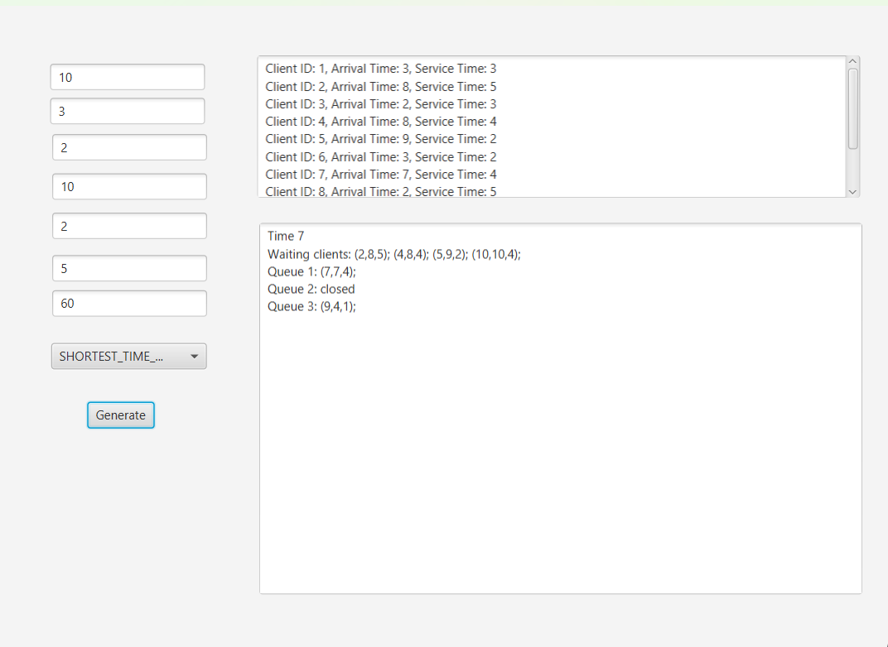

# Queues Management Application Documentation

## 1. Assignment Objective

The objective of this assignment is to design and implement a queues management application. This system will assign clients to queues in such a way that their waiting time is minimized.

The simulation involves N clients, each characterized by three parameters:
- **ID:** A unique identifier between 1 and N.
- **Arrival Time:** The simulation time when the client arrives to join the queue.
- **Service Time:** The duration the client requires to be served.

The application tracks the total time spent by each client in the queues and computes the average waiting time. Clients are assigned to the queue with the shortest waiting time, based on the strategy selected (Shortest Queue or Shortest Time). The system also logs events, such as client arrivals, queue status, and performance metrics.

The input data includes:
- Number of clients (N)
- Number of queues (Q)
- Maximum simulation time
- Arrival time range (min, max)
- Service time range (min, max)

  

## 2. Design

The system is designed based on object-oriented principles, focusing on modularization and encapsulation. The architecture includes multiple classes and interfaces to manage various tasks.

- **SimulationManager**: Orchestrates the simulation process.
- **Queue**: Represents individual queues in the simulation system.
- **Client**: Models the clients in the system.
- **Scheduler**: Dispatches clients to queues based on selected strategies.
- **Strategy**: Interface for implementing different client dispatch strategies.

### Data Structures
- **BlockingQueue**: Used for managing client queues.
- **Custom Data Structures**: To represent clients and manage the scheduling.

### Interfaces
- **Strategy Interface**: Defines methods for queue selection strategies.

### Algorithms
- **Client Dispatching Algorithms**: Used to determine which queue a client should be assigned to based on the strategy.

## 3. Conclusions

### What I Have Learned:
This project provided valuable experience in multithreading and concurrent execution. Implementing the simulation with threads allowed for realistic representation of clients interacting with multiple queues simultaneously. I also learned about managing shared resources, ensuring thread safety, and handling synchronization issues in a multi-threaded environment.

### Future Development:
- **Pause and Resume Functionality**: Allow users to pause and resume simulations.
- **Field Reset**: Add functionality to reset all fields to their initial state.
- **Enhanced Interface**: Improve the interface for a more user-friendly experience.

